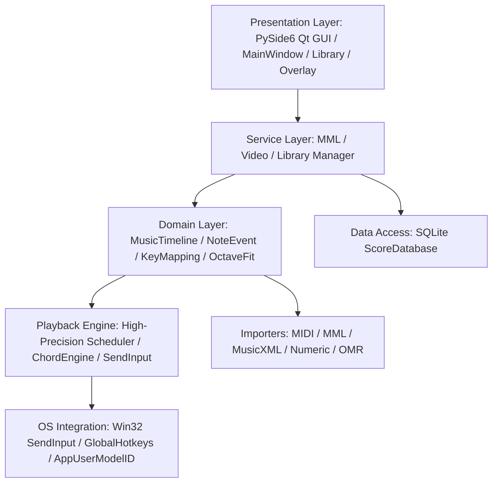
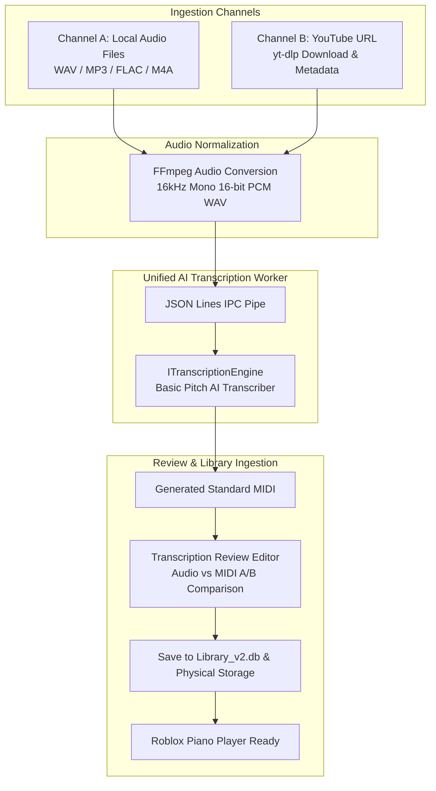
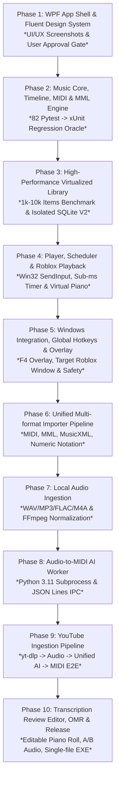

# Roblox Piano Player V2 — C# / .NET 10 / WPF Migration Plan & Architecture Specification (Frozen)

> **Document Status**: Phase 0.5 Final Freeze — Architecture, Roadmap & Data Safety Specification  
> **Target Platform**: C# 14, .NET 10 LTS, WPF, Windows 10/11 x64  
> **Source Repository**: `https://github.com/mochi-ms/roblox_piano`  
> **Reference Baseline**: Python 3.13 + PySide6 (82 Pytest Unit/Integration Suite 100% Pass)  
> **Legacy Policy**: Dual-track Coexistence in `/v2/` without deleting or modifying legacy Python reference code.  
> **Development Principle**: UI/UX First Validation Gate & Complete Database Isolation.

---

## 1. Current Architecture Overview (Python + PySide6)

현재 Roblox Piano Player(V1)는 Python 3.13과 PySide6 Qt GUI 프레임워크를 기반으로 구축되어 있습니다.
계층 구조는 다음과 같이 5개 주요 레이어로 분리되어 있습니다:



- **Presentation Layer**: `src/app/` (`MainWindow`, `LibraryWidget`, `FloatingOverlay`, `VirtualPianoWidget`, `PianoRollWidget`, `MmlDialog`, `SettingsWindow`)
- **Domain Layer**: `src/music/` (`MusicTimeline`, `NoteEvent`, `ChordGroup`, `PedalEvent`, `RangeProcessor`, `HandAssignment`) & `src/piano/` (`RobloxPianoMapper`, `PianoProfile`)
- **Playback Layer**: `src/playback/` (`PlaybackScheduler`, `ChordEngine`, `KeyStateManager`, `WindowsSendInputBackend`, `MousePedalBackend`)
- **Importers Layer**: `src/importers/` (`MidiImporter`, `MmlImporter`, `MusicXmlImporter`, `NumericImporter`, `PdfImporter`, `ImageImporter`)
- **Data Layer**: `src/library/` (`ScoreDatabase`, `LibraryManager`, `ScoreItem`, `FolderItem`)
- **OS Integration**: `src/hotkeys/` (`GlobalHotkeyManager`), `src/windows/` (`TargetWindowManager`), `src/utils/` (`icon_loader`, `config`)

---

## 2. Current Feature Inventory & Porting Classification (25 Core Areas)

### [Classification Criteria]
- **Category A**: C# / .NET 10 / WPF로 완전 이식 (Native High Performance) — **22개**
- **Category B**: Python Worker 유지 (무거운 ML/음원 분리/yt-dlp 등 격리 프로세스 및 JSON Lines IPC) — **2개**
- **Category C**: 기존 코드에서 알고리즘 및 시각화 로직만 참고하여 C# 고성능 렌더링 재구현 — **1개**
- **Category D**: 폐기 / 전면 대체 — **0개**
- **Total**: **25개**

| # | 영역 (Feature Area) | 현재 Python 모듈 및 동작 세부사항 | V2 목표 기술 스택 | 분류 |
| :---: | :--- | :--- | :--- | :---: |
| **1** | **Main Window / Navigation** | `src/app/main_window.py`<br>- Landing drop view, Player tab, Library tab, Video import tab<br>- Navigation stack, Window resize handler | `RobloxPiano.Desktop`<br>- WPF `MainWindow.xaml`, MVVM Navigation Service, Fluent Window styling | **A** |
| **2** | **Player** | `src/app/main_window.py` (`_build_player_view`)<br>- Play/Pause/Stop, Seek slider, Speed (0.5x~2.0x), Transpose (-12~+12), Hand split mute (RH/LH) | `RobloxPiano.Desktop`<br>- `Views/PlayerView.xaml`, `ViewModels/PlayerViewModel.cs` | **A** |
| **3** | **Piano Roll** | `src/app/piano_roll_widget.py`<br>- `QPainter` 2D Canvas rendering, dynamic playhead, note blocks with velocity/hand colors | `RobloxPiano.Desktop`<br>- `Controls/PianoRollControl.cs` (`DrawingVisual` / `WriteableBitmap` 60fps high performance) | **C** |
| **4** | **Virtual Piano** | `src/app/virtual_piano_widget.py`<br>- 61/88 key interactive keyboard, active note highlight, key mapping character labels | `RobloxPiano.Desktop`<br>- `Controls/VirtualPianoControl.xaml` (Vector-based key layout, DataTrigger animations) | **A** |
| **5** | **Scheduler** | `src/playback/scheduler.py`<br>- Worker thread, `time.perf_counter()`, sleep slice, tick offset, state machine (`IDLE`, `COUNTDOWN`, `PLAYING`, `PAUSED`, `STOPPED`) | `RobloxPiano.Playback.Windows`<br>- `PlaybackScheduler.cs` (`Stopwatch.GetTimestamp()`, `timeBeginPeriod(1)`, sub-ms spin-wait loop) | **A** |
| **6** | **MIDI Importer** | `src/importers/midi_importer.py`<br>- `mido` parsing, track split, tempo change map, pitch quantization to `MusicTimeline` | `RobloxPiano.Core`<br>- `Importers/MidiImporter.cs` (Using `Melanchall.DryWetMidi`) | **A** |
| **7** | **MML Importer** | `src/importers/mml_importer.py`<br>- Regex tokenizer, NoteIR immediate snapshot, forward-only default length state, `N58L8`, `CL16`, multi-track tempo sync, tie chaining | `RobloxPiano.Core`<br>- `Importers/MmlImporter.cs` (C# 1:1 Regex Tokenizer, NoteIR state snapshot, Zero-regression) | **A** |
| **8** | **MusicXML Importer** | `src/importers/musicxml_importer.py`<br>- XML DOM parsing, Part/Measure/Staff extraction, Division/Duration to seconds conversion | `RobloxPiano.Core`<br>- `Importers/MusicXmlImporter.cs` (`System.Xml.Linq.XDocument`) | **A** |
| **9** | **Numeric Notation** | `src/importers/numeric_importer.py`<br>- Numbered musical notation (1-7, octave dots, accidentals, duration dashes/underlines, chords) | `RobloxPiano.Core`<br>- `Importers/NumericImporter.cs` | **A** |
| **10** | **PDF / Image OMR** | `src/omr/`, `src/importers/pdf_importer.py`<br>- Audiveris Java CLI wrapper / OEMER ONNX AI model | `RobloxPiano.Core` / `workers/`<br>- Audiveris CLI: C# Process wrapper (A)<br>- OEMER ML: Python Worker (B) | **B** |
| **11** | **Video / YouTube** | `src/video/` (`youtube_adapter.py`, `pipeline.py`)<br>- `yt-dlp` download, FFmpeg extraction, Basic Pitch audio-to-MIDI transcription | `workers/transcription-python/`<br>- Python 3.11 isolated subprocess + JSON Lines IPC | **B** |
| **12** | **Library Management** | `src/library/manager.py`, `src/app/library_widget.py`<br>- Windows 11 Explorer 2-Row Layout, Breadcrumbs, Command Ribbon, Sidebar Tree, Details Table, Safe Recycle Bin | `RobloxPiano.Desktop` & `RobloxPiano.Core`<br>- `Views/LibraryView.xaml`, `ViewModels/LibraryViewModel.cs`, `LibraryManager.cs` | **A** |
| **13** | **SQLite / DB 구조** | `src/library/database.py`<br>- `scores` and `folders` tables, recursive tree traversal, search indices, metadata columns | `RobloxPiano.Infrastructure`<br>- `Data/ScoreRepository.cs` (`Microsoft.Data.Sqlite`, 100% schema backward compatibility) | **A** |
| **14** | **Folder Management** | `src/library/manager.py`<br>- Create, rename, physical folder move, recursive tree import, cycle prevention (`is_descendant`) | `RobloxPiano.Core`<br>- `Services/FolderService.cs` | **A** |
| **15** | **Drag & Drop** | `src/app/library_widget.py`<br>- External file/folder OS drag-and-drop, internal table/tree drag-and-drop move | `RobloxPiano.Desktop`<br>- WPF `DragDrop` events, Shell `IDataObject` handling | **A** |
| **16** | **Search** | `src/library/manager.py`<br>- Real-time keyword filter (title, path, folder, tags), debounced search | `RobloxPiano.Core`<br>- `Services/SearchService.cs` (LINQ / SQLite FTS5) | **A** |
| **17** | **Global Hotkeys** | `src/hotkeys/global_hotkeys.py`<br>- Win32 `RegisterHotKey`, message pump thread, F4 Overlay toggle, Play/Pause, Emergency stop | `RobloxPiano.Playback.Windows`<br>- `Native/GlobalHotkeyManager.cs` (WPF `HwndSource` Hook) | **A** |
| **18** | **SendInput Backend** | `src/playback/sendinput_backend.py`<br>- Win32 `SendInput`, `KEYBDINPUT`, scan code translation, modifier separation, Shift hold | `RobloxPiano.Playback.Windows`<br>- `Native/WindowsSendInputBackend.cs` (P/Invoke hardware scan codes) | **A** |
| **19** | **Roblox Keyboard Mapping** | `src/piano/mapper.py`, `src/piano/profile.py`<br>- 61/88 key pitch-to-char mapping (`default.json`), Transpose, Shift accidentals | `RobloxPiano.Core`<br>- `Piano/RobloxPianoMapper.cs`, `Piano/PianoProfile.cs` | **A** |
| **20** | **61/88 Key Handling & Octave Fit** | `src/music/range_processor.py`, `src/music/hand_assignment.py`<br>- Automatic octave shifting, out-of-range clipping, RH/LH pitch split threshold (C4) | `RobloxPiano.Core`<br>- `Music/RangeProcessor.cs`, `Music/HandAssignmentService.cs` | **A** |
| **21** | **Sustain / Pedal Support** | `src/playback/pedal_backend.py`<br>- MIDI CC64 event interpretation, Spacebar sustain emulation, note release expansion | `RobloxPiano.Playback.Windows`<br>- `Playback/PedalController.cs` | **A** |
| **22** | **Floating Overlay** | `src/app/floating_overlay.py`<br>- Transparent frameless topmost window, click-through toggle, mini progress bar, F4 toggle | `RobloxPiano.Desktop`<br>- `Views/OverlayWindow.xaml` (`WS_EX_LAYERED`, `WS_EX_TRANSPARENT`) | **A** |
| **23** | **Settings** | `src/app/settings_window.py`, `src/utils/config.py`<br>- `settings.json` persistence, hotkey bindings, focus loss safety policy, conflict policy | `RobloxPiano.Core` & `Desktop`<br>- `Configuration/AppConfig.cs` (`System.Text.Json`), `SettingsView.xaml` | **A** |
| **24** | **App Icon & Multi-Size Resources** | `src/resources/app_icon.ico`, `src/utils/icon_loader.py`<br>- 7 resolution layers (16~256px), Windows `AppUserModelID` grouping | `RobloxPiano.Desktop`<br>- Embedded Application Icon `.ico`, WPF Window Icon, Win32 AppID | **A** |
| **25** | **Current Tests** | `tests/` (23 test files, 82 test cases)<br>- MML timing, Library CRUD, D&D, Conflict policy, Scheduler, Importers | `tests/RobloxPiano.Core.Tests/`<br>- xUnit + FluentAssertions (100% 1:1 test oracle mapping) | **A** |

---

## 3. UI/UX Design System & Polish Specification (Freeze)

V2 Desktop UI는 기존 Python/PySide의 투박함과 잦은 UI 리팩토링 문제를 원천 해결하기 위해, **Sony / Canon Professional Utility, Microsoft PowerToys, Windows 11 Fluent** 수준의 정제되고 절제된 Dark Graphite 디자인 시스템을 엄격히 준수합니다.

```
[Main Navigation Bar]
[ Player ]  [ Library ]  [ Transcribe ]  [ Settings ]       [ Roblox State: Attached (PID 1234) ]
```

### [A] Design Rules & Prohibitions
- **절대 금지**:
  - 화려한 AI 대시보드 스타일 및 거대한 카드들의 남발
  - 이모지(Emoji) 및 유니코드 문자를 아이콘 대신 사용하는 행위 (오직 정밀한 SVG Vector Icon만 사용)
  - 과도한 그라디언트, 눈부신 블루 네온, 산만한 컬러 팔레트
  - 모든 컨테이너와 위젯마다 두꺼운 테두리(Border)를 두르는 행위
  - 지나치게 둥근 코너(Over-rounded corners)
  - 화면을 낭비하는 거대한 Play 버튼 및 빽빽하게 욱여넣어진 툴바
- **시각 계층 및 상태 표현**:
  - Roblox 연결 상태는 거대한 별도 카드가 아니라 상단 바 또는 상태 표시줄에 단정한 인디케이터로 표현.
  - Accent Color는 사용자의 주의가 필수적인 활성 상태 및 주요 액션(Primary Action)에만 절제하여 사용.

### [B] Design Tokens
- **Color Palette (Dark Graphite)**:
  - Background Root: `#0D1117`
  - Surface Elevated: `#161B22`
  - Surface Hover: `#21262D`
  - Border Subtle: `#21262D`
  - Border Default: `#30363D`
  - Text Primary: `#F0F6FC`
  - Text Secondary: `#8B949E`
  - Accent Blue: `#388BFD`
  - Accent Muted: `#1F3A60`
  - Selection Highlight: `#1C2B42` (Left accent `#388BFD`)
- **Typography**:
  - Primary Font: `Segoe UI Variable` (fallback `Segoe UI`, `Malgun Gothic`, `-apple-system`)
  - Title: 16px / Semibold (Header)
  - Subtitle / Tab: 13px / Medium
  - Body / Grid: 12.5px / Regular
  - Caption / Metadata: 11.5px / Regular (`#8B949E`)
- **Spacing Tokens**:
  - `4px`, `8px`, `12px`, `16px`, `24px`, `32px`
- **Corner Radius Tokens**:
  - Compact: `4px`
  - Standard: `6px`
  - Maximum: `8px` (8px 초과 라운딩 금지)

---

## 4. Library High-Performance Principles (Freeze)

V1의 치명적 한계였던 "단일 파일/폴더 변경 시 전체 `QStandardItemModel`을 clear하고 처음부터 다시 그리는 구조"를 V2에서는 완전히 금지합니다.

### [A] Architectural Requirements
1. **UI Virtualization & Recycling**:
   - WPF `VirtualizingStackPanel` 및 Virtualizing DataGrid를 적용하여 10,000개 이상의 악보가 존재하더라도 현재 뷰포트에 표시되는 20~30개의 Row만 렌더링.
2. **Incremental Observable Updates**:
   - 전체 리스트 재구성 금지. 단일 파일의 추가/수정/삭제 시 `ObservableCollection<ScoreItemViewModel>`의 해당 아이템만 증분 갱신(Incremental update).
3. **Asynchronous Non-Blocking Repository**:
   - 모든 DB 쿼리 및 디렉토리 스캔은 `IAsyncEnumerable` 또는 `Task<List<ScoreItem>>` 기반의 비동기 파이프라인으로 실행되어 UI 쓰레드 프리징(0ms UI lag) 방지.
4. **Search Debounce & Fast Filter**:
   - 검색창 입력 시 150ms 디바운스 타이머를 적용하고, 메모리 캐시 및 SQLite FTS5를 통해 타이핑 즉시 즉각적인 필터링 수행.
5. **Scalability Target**:
   - **1,000개**, **5,000개**, **10,000개** 대용량 라이브러리 데이터셋에서도 60fps 부드러운 스크롤과 즉각적인 반응성 보장 (Phase 3에서 벤치마크 수행).

---

## 5. Unified Transcription Architecture & AI Flow (Freeze)

### [A] Architecture Boundary
- **Main WPF App (.NET 10)**: 비즈니스 로직, 오디오 파일 수신, IPC 파이프 관리, 악보 뷰어 및 연주.
- **AI Worker (Python 3.11 Standalone Subprocess)**: 무거운 딥러닝 모델(`basic-pitch`, `torch`/`onnx`), `yt-dlp`, `ffmpeg` 실행.
- **통신 방식**: Standard Input / Output (stdin/stdout) 기반 UTF-8 JSON Lines (`ndjson`) 비동기 프로토콜.
- **엔진 추상화**: `ITranscriptionEngine` 인터페이스를 통해 Basic Pitch 외에도 향후 피아노 특화 AI 모델(e.g., Onsets & Frames, ByteDance Piano)을 손쉽게 플러그인할 수 있는 아키텍처 구축.

### [B] Single Unified Ingestion Pipeline
YouTube 다운로드와 Local Audio 변환은 서로 다른 엔진을 사용하지 않으며, **단일 공통 AI Transcription Pipeline**을 공유합니다:



---

## 6. Database Safety & Storage Isolation Policy (Freeze)

> [!CAUTION]
> **Production SQLite DB Isolation Rule**:
> V2 개발 및 테스트 과정에서 레거시 V1 데이터베이스(`scores.db` / `library.db`)에 절대 Write 작업을 수행하지 않습니다.

1. **V1 Database (Read-Only Source)**:
   - 기존 V1 SQLite DB는 오직 원본 데이터 읽기 참조용으로만 취급합니다.
2. **V2 Database (`library_v2.db`)**:
   - V2는 `%LOCALAPPDATA%\RobloxPianoPlayer\library_v2.db`라는 완전히 독립된 데이터베이스 파일을 생성하여 사용합니다.
3. **Migration Flow**:
   - V2 최초 실행 시 V1 데이터 가져오기:
     $$\text{V1 DB (Read)} \longrightarrow \text{Auto Backup (.bak)} \longrightarrow \text{V2 Import Engine} \longrightarrow \text{library\_v2.db (Write)}$$
   - V1과 V2를 교대로 실행하더라도 데이터 손실, 레코드 락, 스키마 오염이 구조적으로 발생하지 않도록 100% 격리합니다.

---

## 7. Ten-Phase Corrected Roadmap & Strict Phase Gate Policy

"기능을 먼저 대량 개발한 뒤 나중에 UI를 고치느라 전체 구조를 뜯어고치는 문제"를 방지하기 위해, **UI/UX Foundation을 최우선으로 검증하는 10단계 로드맵**을 적용합니다.



### [Phase Gate Enforcement]
- **모든 Phase는 다음 6대 종료 조건을 만족해야 완료됩니다**:
  1. `dotnet build` 0 Warnings, 0 Errors
  2. Automated Tests (xUnit) 100% Pass
  3. Real Process Smoke Run Verification
  4. Measurable Concrete Evidence Reporting
  5. Clean Git Commit
  6. **User Explicit Review & Approval**
- **AI Agent는 사용자 승인 없이 다음 Phase를 절대 임의로 자동 진행하지 않습니다.**
- 각 Phase 완료 시 반드시 다음 형식으로 보고하고 대기합니다:
  ```
  PHASE N COMPLETE
  NEXT PHASE READY: YES/NO
  ```

---

### [Detailed Phase Specifications]

#### 🎨 PHASE 1 — WPF App Shell & Fluent Design System
- **목표**: 실제 음악 엔진 구현 전, WPF 데스크톱 쉘과 현대적인 Fluent Dark 디자인 시스템을 먼저 빌드하여 **사용자에게 실제 UI/UX 방향을 완벽히 검증받는 단계**.
- **구현 내용**:
  - `v2/RobloxPiano.sln` 솔루션 생성 (.NET 10 LTS, C# 14, WPF).
  - `MainWindow.xaml`: 모던 프레임리스 윈도우, Mica/Acrylic 지원, 커스텀 타이틀바.
  - Main Navigation: `Player`, `Library`, `Transcribe`, `Settings` 탭 전환 및 MVVM 뷰모델 구조.
  - 4개 Mock Views:
    - `PlayerView.xaml` (플레이어 모크업, 재생 컨트롤, 상태 표시)
    - `LibraryView.xaml` (Windows 11 Explorer 스타일 2-Row 네비게이션 및 커맨드 바)
    - `TranscribeView.xaml` (Local Audio 및 YouTube Ingestion 모크업)
    - `SettingsDialog.xaml` (설정 모크업)
  - 디자인 토큰 시스템: Dark Graphite 팔레트, Segoe UI Variable 타이포그래피, Spacing/Radius 토큰, SVG Vector Icons.
  - Multi-Resolution High-DPI 지원: **1280x720, 1366x768, 1600x900, 1920x1080** 레이아웃 반응형 대응.
  - 7개 레이어 멀티사이즈 `app_icon.ico` 임베딩 및 Win32 `AppUserModelID` 등록.
- **Phase Gate Deliverables**:
  - 1280x720, 1366x768, 1920x1080 실제 GUI 실행 스크린샷 캡처 및 증거 제시.
  - 사용자 디자인 승인 획득 전까지 Phase 2 진입 금지.

#### 🎵 PHASE 2 — Music Core / MIDI / MML Engine
- **목표**: 도메인 엔티티 및 음악 파싱 엔진의 C# 완전 이식 (Python 82개 테스트 검증 오라클 활용).
- **구현 내용**:
  - `RobloxPiano.Core`: `MusicTimeline`, `NoteEvent`, `PedalEvent`, `ChordGroup`, `RobloxPianoMapper`, `PianoProfile`, `RangeProcessor`, `HandAssignmentService`.
  - `MidiImporter`: `Melanchall.DryWetMidi` 기반 표준 MIDI 파싱.
  - `MmlImporter`: NoteIR 타이밍 엔진 1:1 이식 (`N58L8`, `CL16`, Forward-only default length, Note duration immediate snapshot, Multi-track tempo sync, Tie chaining).
  - `RobloxPiano.Core.Tests`: xUnit 기반 11개 MML 타이밍 테스트, 6개 다이얼렉트 테스트, MIDI 임포트 단위 테스트 100% 통과.

#### 🗄️ PHASE 3 — High-Performance Virtualized Library
- **목표**: 대용량 악보를 지연 없이 관리하는 초고성능 Virtualized Explorer 구현.
- **구현 내용**:
  - `RobloxPiano.Infrastructure`: `Microsoft.Data.Sqlite` 기반 `SqliteScoreRepository`, 격리된 `library_v2.db` 스키마.
  - V1 데이터 무손실 백업 및 Read-only Migration 서비스.
  - WPF UI Virtualization (`VirtualizingStackPanel`), Item Recycling, Incremental Observable Collection.
  - 비동기 검색 및 150ms 디바운스 필터링, 메타데이터 캐싱.
  - **1k, 5k, 10k 아이템 가상화 스크롤/검색 성능 벤치마크 (60fps 유지 검증)**.

#### 🎹 PHASE 4 — Player & Roblox Playback Engine
- **목표**: 나노초 정밀도의 고성능 스케줄러와 SendInput 하드웨어 키보드 연주 엔진.
- **구현 내용**:
  - `RobloxPiano.Playback.Windows`: Win32 `timeBeginPeriod(1)` + `Stopwatch.GetTimestamp()` 서브밀리초 하이브리드 스핀-웨이트 `PlaybackScheduler`.
  - `WindowsSendInputBackend`: Win32 P/Invoke 하드웨어 스캔 코드 전송.
  - `ChordEngine`: Modifier Grouping (Normal 키 그룹 -> Micro-arpeggio -> Shift 키 그룹) 키 충돌 방지.
  - `VirtualPianoControl.xaml`: 61/88 키 인터랙티브 건반 벡터 위젯.
  - `PianoRollControl.cs`: `DrawingVisual` / `WriteableBitmap` 기반 60fps 고성능 피아노 롤 렌더링.

#### 🪟 PHASE 5 — Windows Integration, Hotkeys & Overlay
- **목표**: 시스템 레벨 글로벌 단축키, 플로팅 오버레이 및 타깃 창 연동.
- **구현 내용**:
  - `GlobalHotkeyManager`: Win32 `RegisterHotKey` (F4 Overlay Toggle, Play/Pause, Emergency Key Release All).
  - `OverlayWindow.xaml`: Frameless Transparent Topmost 오버레이 (`WS_EX_LAYERED`, `WS_EX_TRANSPARENT`), 미니 프로그레스.
  - `TargetWindowManager`: Roblox 창 포커스 감지 및 비상 정지 안전 정책.
  - `SettingsService`: `System.Text.Json` 기반 설정 영속화.

#### 🎼 PHASE 6 — Unified Multi-Format Importer Pipeline
- **목표**: 모든 악보 포맷을 도메인 `MusicTimeline`으로 통합 변환.
- **구현 내용**:
  - `MusicXmlImporter`: XDocument 기반 파트/보표/음표/쉼표/붙임줄 파싱.
  - `NumericImporter`: 숫자 악보 (1-7, 옥타브 점, 임시표, 언더라인 박자).
  - `PdfImporter` & `ImageImporter`: Audiveris Java CLI 프로세스 어댑터 연동.

#### 🎧 PHASE 7 — Local Audio Ingestion
- **목표**: 로컬 오디오 파일 파싱 및 오디오 정규화 파이프라인.
- **구현 내용**:
  - 로컬 오디오 포맷 지원: WAV, MP3, FLAC, M4A, OGG.
  - FFmpeg 파이프라인 연동: 16kHz Mono 16-bit PCM WAV 무손실 표준화.
  - 로컬 오디오 파일 기반 전처리 검증.

#### 🤖 PHASE 8 — Audio-to-MIDI AI Worker
- **목표**: 격리된 Python 3.11 Subprocess 기반 오디오-to-MIDI AI 트랜스크립션.
- **구현 내용**:
  - `workers/transcription-python/`: `worker.py` (Basic Pitch AI 엔진 구동).
  - C# `SubprocessTranscriptionWorker`: stdin/stdout JSON Lines IPC 클라이언트.
  - `ITranscriptionEngine` 인터페이스 추상화.
  - 트랜스크립션 결과 MIDI 파싱 및 무결성 검증.

#### 📺 PHASE 9 — YouTube Ingestion Pipeline
- **목표**: YouTube 음원 다운로드 및 공통 AI 파이프라인 E2E 통합.
- **구현 내용**:
  - Python Worker 내 `yt-dlp` 어댑터 연동 (URL 메타데이터, 오디오 스트림 추출, 취소/진행률 통지).
  - **YouTube URL ➔ yt-dlp ➔ FFmpeg WAV ➔ [공통 AI Worker] ➔ MIDI ➔ Library ➔ Player E2E 파이프라인 완성**.

#### 🚀 PHASE 10 — Review Editor, OMR & Final Release
- **목표**: 트랜스크립션 검수 에디터, OMR 통합, 단일 실행 파일 패키징 및 최종 릴리즈.
- **구현 내용**:
  - Transcription Review Editor: 편집 가능한 피아노 롤 및 Audio vs MIDI A/B 동기화 재생 비교.
  - OEMER OMR Worker 연동.
  - 종합 시스템 성능 및 메모리 누수 감사.
  - Self-contained Single-file EXE Publish (`dotnet publish -r win-x64 -c Release -p:PublishSingleFile=true`).
  - 최종 릴리즈 및 V1-to-V2 마이그레이션 안내.

---

## 8. Current Audit & Frozen Checklist

- [x] **Phase Order Corrected**: UI/UX First Validation Roadmap (Phases 1 to 10)
- [x] **Database Safety Enforced**: V1 DB Read-Only & Isolated `library_v2.db`
- [x] **Legacy Python Code Preserved**: 0 Modified / 0 Deleted files
- [x] **UI/UX Design Tokens Frozen**: Dark Graphite, Segoe UI Variable, Spacing/Radius Tokens
- [x] **Library Performance Principles Frozen**: Virtualization, Recycling, Async Repo, 10k Items Scaling
- [x] **AI Architecture Frozen**: Subprocess JSON Lines IPC & `ITranscriptionEngine`
- [x] **Single Ingestion Pipeline Frozen**: Local Audio & YouTube share Common AI Core
- [x] **Phase Gate Policy Active**: Explicit User Review & Screenshots required after each phase
- [x] **Feature Classification Corrected**: 22 Cat-A / 2 Cat-B / 1 Cat-C / 0 Cat-D (Total 25)

---

## 9. Final Phase 0.5 Status

**PHASE 0.5 COMPLETE**  
**PHASE 1 READY: YES (Awaiting User Review & Approval to start Phase 1 WPF App Shell)**
