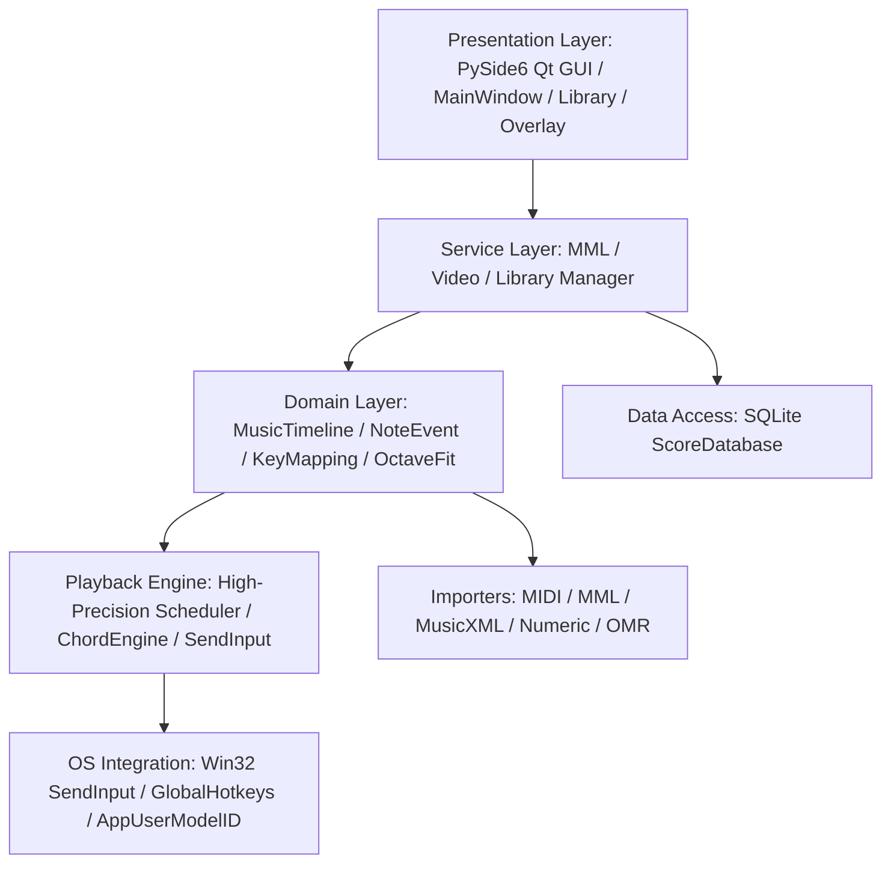
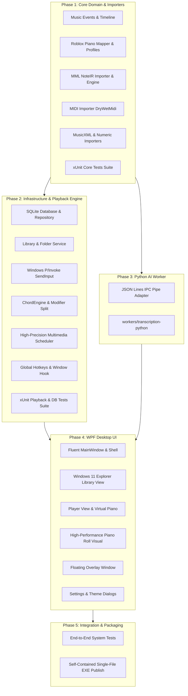

# Roblox Piano Player V2 — C# / .NET 10 / WPF Migration Plan & Architecture Audit

> **Document Status**: Phase 0 Complete — Audit & Architecture Specification  
> **Target Platform**: C# 13, .NET 10 LTS, WPF, Windows 10/11 x64  
> **Source Repository**: `https://github.com/mochi-ms/roblox_piano`  
> **Reference Baseline**: Python 3.13 + PySide6 (82 Pytest Unit/Integration Suite 100% Pass)  
> **Rollout Policy**: Dual-track Coexistence in `/v2/` without deleting or modifying legacy Python reference code.

---

## 1. Current Architecture Overview (Python + PySide6)

현재 Roblox Piano Player(V1)는 Python 3.13과 PySide6 Qt GUI 프레임워크를 기반으로 구축되어 있습니다.
계층 구조는 다음과 같이 5개 주요 레이어로 분리되어 있습니다:



- **Presentation Layer**: `src/app/` (`MainWindow`, `LibraryWidget`, `FloatingOverlay`, `VirtualPianoWidget`, `PianoRollWidget`, `MmlDialog`, `SettingsWindow`)
- **Domain Layer**: `src/music/` (`MusicTimeline`, `NoteEvent`, `ChordGroup`, `PedalEvent`, `RangeProcessor`, `HandAssignment`) & `src/piano/` (`RobloxPianoMapper`, `PianoProfile`)
- **Playback Layer**: `src/playback/` (`PlaybackScheduler`, `ChordEngine`, `KeyStateManager`, `WindowsSendInputBackend`, `MousePedalBackend`)
- **Importers Layer**: `src/importers/` (`MidiImporter`, `MmlImporter`, `MusicXmlImporter`, `NumericImporter`, `PdfImporter`, `ImageImporter`)
- **Data Layer**: `src/library/` (`ScoreDatabase`, `LibraryManager`, `ScoreItem`, `FolderItem`)
- **OS Integration**: `src/hotkeys/` (`GlobalHotkeyManager`), `src/windows/` (`TargetWindowManager`), `src/utils/` (`icon_loader`, `config`)

---

## 2. Current Feature Inventory & Porting Classification

### [Classification Criteria]
- **Category A**: C# / .NET 10 / WPF로 완전 이식 (Native High Performance)
- **Category B**: Python Worker 유지 (무거운 ML/음원 분리/yt-dlp 등 격리 프로세스 및 JSON Lines IPC)
- **Category C**: 기존 코드에서 알고리즘 및 시각화 로직만 참고하여 C# 고성능 렌더링 재구현
- **Category D**: 폐기 / V2 전용 재설계 후보

| # | 영역 (Feature Area) | 현재 Python 모듈 및 동작 세부사항 | V2 목표 기술 스택 | 분류 |
| :---: | :--- | :--- | :--- | :---: |
| **1** | **Main Window / Navigation** | `src/app/main_window.py`<br>- Landing drop view, Player tab, Library tab, Video import tab<br>- Navigation stack, Window resize handler | `RobloxPiano.Desktop`<br>- WPF `MainWindow.xaml`, MVVM Navigation Service, Fluent Window styling | **A** |
| **2** | **Player** | `src/app/main_window.py` (`_build_player_view`)<br>- Play/Pause/Stop, Seek slider, Speed (0.5x~2.0x), Transpose (-12~+12), Hand split mute (RH/LH) | `RobloxPiano.Desktop`<br>- `Views/PlayerView.xaml`, `ViewModels/PlayerViewModel.cs` | **A** |
| **3** | **Piano Roll** | `src/app/piano_roll_widget.py`<br>- `QPainter` 2D Canvas rendering, dynamic playhead, note blocks with velocity/hand colors | `RobloxPiano.Desktop`<br>- `Controls/PianoRollControl.cs` (`DrawingVisual` / `WriteableBitmap` 60fps high performance) | **C** |
| **4** | **Virtual Piano** | `src/app/virtual_piano_widget.py`<br>- 61/88 key interactive keyboard, active note highlight, key mapping character labels | `RobloxPiano.Desktop`<br>- `Controls/VirtualPianoControl.xaml` (Vector-based key layout, DataTrigger animations) | **A** |
| **5** | **Scheduler** | `src/playback/scheduler.py`<br>- Worker thread, `time.perf_counter()`, sleep slice, tick offset, state machine (`IDLE`, `COUNTDOWN`, `PLAYING`, `PAUSED`, `STOPPED`) | `RobloxPiano.Playback.Windows`<br>- `PlaybackScheduler.cs` (`Stopwatch.GetTimestamp()`, `timeBeginPeriod(1)`, sub-ms spin-wait loop) | **A** |
| **6** | **MIDI Importer** | `src/importers/midi_importer.py`<br>- `mido` parsing, track split, tempo change map, pitch quantization to `MusicTimeline` | `RobloxPiano.Core`<br>- `Importers/MidiImporter.cs` (Using `Melanchall.DryWetMidi`) | **A** |
| **7** | **MML Importer** | `src/importers/mml_importer.py`<br>- Regex tokenizer, NoteIR immediate snapshot, forward-only default length state, `N58L8`, `CL16`, multi-track tempo sync, tie chaining | `RobloxPiano.Core`<br>- `Importers/MmlImporter.cs` (C# 1:1 Regex Tokenizer, NoteIR state snapshot, Zero-regression) | **A** |
| **8** | **MusicXML Importer** | `src/importers/musicxml_importer.py`<br>- XML DOM parsing, Part/Measure/Staff extraction, Division/Duration to seconds conversion | `RobloxPiano.Core`<br>- `Importers/MusicXmlImporter.cs` (`System.Xml.Linq.XDocument`) | **A** |
| **9** | **Numeric Notation** | `src/importers/numeric_importer.py`<br>- Numbered musical notation (1-7, octave dots, accidentals, duration dashes/underlines, chords) | `RobloxPiano.Core`<br>- `Importers/NumericImporter.cs` | **A** |
| **10** | **PDF / Image OMR** | `src/omr/`, `src/importers/pdf_importer.py`<br>- Audiveris Java CLI wrapper / OEMER ONNX AI model | `RobloxPiano.Core` / `workers/`<br>- Audiveris CLI: C# Process wrapper (A)<br>- OEMER ML: Python Worker (B) | **B** |
| **11** | **Video / YouTube** | `src/video/` (`youtube_adapter.py`, `pipeline.py`)<br>- `yt-dlp` download, FFmpeg extraction, Basic Pitch audio-to-MIDI transcription | `workers/transcription-python/`<br>- Python 3.11 isolated subprocess + JSON Lines IPC | **B** |
| **12** | **Library Management** | `src/library/manager.py`, `src/app/library_widget.py`<br>- Windows 11 Explorer 2-Row Layout, Breadcrumbs, Command Ribbon, Sidebar Tree, Details Table, Safe Recycle Bin | `RobloxPiano.Desktop` & `RobloxPiano.Core`<br>- `Views/LibraryView.xaml`, `ViewModels/LibraryViewModel.cs`, `LibraryManager.cs` | **A** |
| **13** | **SQLite / DB 구조** | `src/library/database.py`<br>- `scores` and `folders` tables, recursive tree traversal, search indices, metadata columns | `RobloxPiano.Infrastructure`<br>- `Data/ScoreRepository.cs` (`Microsoft.Data.Sqlite`, 100% schema backward compatibility) | **A** |
| **14** | **Folder Management** | `src/library/manager.py`<br>- Create, rename, physical folder move, recursive tree import, cycle prevention (`is_descendant`) | `RobloxPiano.Core`<br>- `Services/FolderService.cs` | **A** |
| **15** | **Drag & Drop** | `src/app/library_widget.py`<br>- External file/folder OS drag-and-drop, internal table/tree drag-and-drop move | `RobloxPiano.Desktop`<br>- WPF `DragDrop` events, Shell `IDataObject` handling | **A** |
| **16** | **Search** | `src/library/manager.py`<br>- Real-time keyword filter (title, path, folder, tags), debounced search | `RobloxPiano.Core`<br>- `Services/SearchService.cs` (LINQ / SQLite FTS5) | **A** |
| **17** | **Global Hotkeys** | `src/hotkeys/global_hotkeys.py`<br>- Win32 `RegisterHotKey`, message pump thread, F4 Overlay toggle, Play/Pause, Emergency stop | `RobloxPiano.Playback.Windows`<br>- `Native/GlobalHotkeyManager.cs` (WPF `HwndSource` Hook) | **A** |
| **18** | **SendInput Backend** | `src/playback/sendinput_backend.py`<br>- Win32 `SendInput`, `KEYBDINPUT`, scan code translation, modifier separation, Shift hold | `RobloxPiano.Playback.Windows`<br>- `Native/WindowsSendInputBackend.cs` (P/Invoke hardware scan codes) | **A** |
| **19** | **Roblox Keyboard Mapping** | `src/piano/mapper.py`, `src/piano/profile.py`<br>- 61/88 key pitch-to-char mapping (`default.json`), Transpose, Shift accidentals | `RobloxPiano.Core`<br>- `Piano/RobloxPianoMapper.cs`, `Piano/PianoProfile.cs` | **A** |
| **20** | **61/88 Key Handling & Octave Fit** | `src/music/range_processor.py`, `src/music/hand_assignment.py`<br>- Automatic octave shifting, out-of-range clipping, RH/LH pitch split threshold (C4) | `RobloxPiano.Core`<br>- `Music/RangeProcessor.cs`, `Music/HandAssignmentService.cs` | **A** |
| **21** | **Sustain / Pedal Support** | `src/playback/pedal_backend.py`<br>- MIDI CC64 event interpretation, Spacebar sustain emulation, note release expansion | `RobloxPiano.Playback.Windows`<br>- `Playback/PedalController.cs` | **A** |
| **22** | **Floating Overlay** | `src/app/floating_overlay.py`<br>- Transparent frameless topmost window, click-through toggle, mini progress bar, F4 toggle | `RobloxPiano.Desktop`<br>- `Views/OverlayWindow.xaml` (`WS_EX_LAYERED`, `WS_EX_TRANSPARENT`) | **A** |
| **23** | **Settings** | `src/app/settings_window.py`, `src/utils/config.py`<br>- `settings.json` persistence, hotkey bindings, focus loss safety policy, conflict policy | `RobloxPiano.Core` & `Desktop`<br>- `Configuration/AppConfig.cs` (`System.Text.Json`), `SettingsView.xaml` | **A** |
| **24** | **App Icon & Multi-Size Resources** | `src/resources/app_icon.ico`, `src/utils/icon_loader.py`<br>- 7 resolution layers (16~256px), Windows `AppUserModelID` grouping | `RobloxPiano.Desktop`<br>- Embedded Application Icon `.ico`, WPF Window Icon, Win32 AppID | **A** |
| **25** | **Current Tests** | `tests/` (23 test files, 82 test cases)<br>- MML timing, Library CRUD, D&D, Conflict policy, Scheduler, Importers | `tests/RobloxPiano.Core.Tests/`<br>- xUnit + FluentAssertions (100% 1:1 test oracle mapping) | **A** |

---

## 3. Current Python Module → V2 C# Module Mapping

```
[Legacy Python Module]                              [V2 .NET 10 C# Assembly / Namespace]
---------------------------------------------------------------------------------------------------------
src/music/events.py                 --->            RobloxPiano.Core.Music.Events (NoteEvent, PedalEvent, ChordGroup)
src/music/timeline.py               --->            RobloxPiano.Core.Music.Timeline (MusicTimeline)
src/music/range_processor.py        --->            RobloxPiano.Core.Music.Processing (RangeProcessor, OctaveFit)
src/music/hand_assignment.py        --->            RobloxPiano.Core.Music.Processing (HandAssignmentService)
src/music/transpose.py              --->            RobloxPiano.Core.Music.Processing (TransposeService)

src/piano/profile.py                --->            RobloxPiano.Core.Piano.Models (PianoProfile, KeyMapping)
src/piano/mapper.py                 --->            RobloxPiano.Core.Piano.Mapping (RobloxPianoMapper)
src/piano/profiles/default.json     --->            RobloxPiano.Core/Resources/Profiles/default.json (Embedded)

src/importers/base.py               --->            RobloxPiano.Core.Importers.Abstractions (IMusicImporter)
src/importers/midi_importer.py      --->            RobloxPiano.Core.Importers.Midi (MidiImporter using DryWetMidi)
src/importers/mml_importer.py       --->            RobloxPiano.Core.Importers.Mml (MmlImporter - NoteIR Engine)
src/importers/musicxml_importer.py  --->            RobloxPiano.Core.Importers.MusicXml (MusicXmlImporter)
src/importers/numeric_importer.py   --->            RobloxPiano.Core.Importers.Numeric (NumericImporter)
src/services/mml_service.py         --->            RobloxPiano.Core.Services (MmlService)

src/library/models.py               --->            RobloxPiano.Core.Library.Models (ScoreItem, FolderItem)
src/library/database.py             --->            RobloxPiano.Infrastructure.Data (SqliteScoreRepository)
src/library/manager.py              --->            RobloxPiano.Core.Library.Services (LibraryManager, FolderService)

src/playback/keyboard_backend.py    --->            RobloxPiano.Playback.Windows.Abstractions (IKeyboardBackend)
src/playback/sendinput_backend.py   --->            RobloxPiano.Playback.Windows.Native (WindowsSendInputBackend)
src/playback/dryrun_backend.py      --->            RobloxPiano.Playback.Windows.Backends (DryRunKeyboardBackend)
src/playback/key_state_manager.py   --->            RobloxPiano.Playback.Windows.State (KeyStateManager)
src/playback/chord_engine.py        --->            RobloxPiano.Playback.Windows.Engine (ChordEngine)
src/playback/pedal_backend.py       --->            RobloxPiano.Playback.Windows.Engine (PedalController)
src/playback/scheduler.py           --->            RobloxPiano.Playback.Windows.Scheduler (PlaybackScheduler)

src/hotkeys/global_hotkeys.py       --->            RobloxPiano.Playback.Windows.Native (GlobalHotkeyManager)
src/windows/target_window.py        --->            RobloxPiano.Playback.Windows.Native (TargetWindowManager)

src/utils/config.py                 --->            RobloxPiano.Core.Configuration (AppConfig, ConfigService)
src/utils/icon_loader.py            --->            RobloxPiano.Desktop.Utilities (IconHelper)

src/app/main_window.py              --->            RobloxPiano.Desktop.Views (MainWindow.xaml, PlayerView.xaml)
src/app/library_widget.py           --->            RobloxPiano.Desktop.Views (LibraryView.xaml)
src/app/floating_overlay.py         --->            RobloxPiano.Desktop.Views (OverlayWindow.xaml)
src/app/virtual_piano_widget.py     --->            RobloxPiano.Desktop.Controls (VirtualPianoControl.xaml)
src/app/piano_roll_widget.py        --->            RobloxPiano.Desktop.Controls (PianoRollControl.cs)
src/app/mml_dialog.py               --->            RobloxPiano.Desktop.Views.Dialogs (MmlImportDialog.xaml)
src/app/settings_window.py          --->            RobloxPiano.Desktop.Views.Dialogs (SettingsDialog.xaml)

src/video/ & src/omr/               --->            workers/transcription-python/ (Subprocess IPC Worker)
```

---

## 4. Features Retained in Python Worker (`workers/transcription-python/`)

YouTube 음원 다운로드 및 AI 오디오 트랜스크립션(Basic Pitch), OEMER 악보 인식을 C#으로 무리하게 포팅하지 않고, **격리된 가벼운 Python 3.11 Standalone Worker**로 유지합니다.

### [A] Worker Responsibilities
1. **YouTube Downloader**: `yt-dlp` 최신 엔진을 통해 비디오/오디오 스트림 다운로드 및 FFmpeg 무손실 wav 추출.
2. **Audio Transcription AI**: `basic-pitch` (Spotify AI) 신경망을 실행하여 polyphonic audio를 MIDI로 변환.
3. **OEMER OMR Backend**: 딥러닝 기반 악보 이미지 분석.

### [B] Inter-Process Communication (IPC) Protocol
- **Transport**: Standard Input / Output (stdin/stdout) Streams via UTF-8 JSON Lines (`ndjson`).
- **Command Envelope (C# -> Python)**:
  ```json
  {"id": "req-001", "cmd": "transcribe_youtube", "url": "https://youtu.be/...", "out_dir": "C:\\AppData\\Local\\RobloxPiano\\Temp"}
  ```
- **Progress Envelope (Python -> C#)**:
  ```json
  {"id": "req-001", "type": "progress", "percent": 45.0, "status": "Extracting notes with Basic Pitch..."}
  ```
- **Completion Envelope (Python -> C#)**:
  ```json
  {"id": "req-001", "type": "completed", "midi_path": "C:\\AppData\\Local\\RobloxPiano\\Temp\\transcription.mid", "bpm": 136.0, "duration": 184.2}
  ```
- **Error Envelope (Python -> C#)**:
  ```json
  {"id": "req-001", "type": "error", "message": "Failed to download video: Age restricted"}
  ```

---

## 5. Migration Dependency Graph



---

## 6. Known Regression Risks & Mitigation Strategies

### [Risk 1] MML Parsing & Note Timing Semantics (CRITICAL)
- **위험 요인**: 
  - `N58L8` 또는 `CL16`과 같이 음표 뒤에 공백 없이 붙은 `L` 명령어가 음표 길이로 삼켜지지 않고 독립된 Default Length State 명령어로 처리되어야 함.
  - 파싱 즉시 Note duration을 확정(Snapshot)하는 Forward-only 시맨틱스를 C# 구현 시 유지하지 못하면 전체 악보 박자가 틀어짐.
  - Multi-track 동기화 및 중간 Tie(`&`) 체이닝.
- **방어 대책**:
  - Python에서 검증된 `tests/test_mml_timing.py` 11개 단위 테스트 및 `tests/test_mml_dialect.py` 6개 테스트를 xUnit 테스트로 100% 동일한 테스트 벡터로 이식하여 C# MML Importer의 정합성을 보증.

### [Risk 2] Key Conflicts & Modifier Bleeding in Chords
- **위험 요인**: 
  - `q`와 `Q` (Shift+q)가 동시에 연주될 때 동일한 물리 키를 공유하는 충돌 문제.
  - Shift를 누른 상태에서 소문자 키가 동시에 전송되어 대문자로 잘못 입력되는 Modifier Bleed 현상.
- **방어 대책**:
  - `ChordEngine`의 Modifier Grouping 알고리즘(Normal 키 그룹 전송 -> Micro Arpeggio Delay -> Shift 키 그룹 전송)을 C#에 1:1로 정확히 포팅하고 `test_chords_and_conflicts.py` 테스트 케이스로 검증.

### [Risk 3] Playback Scheduler Timer Precision on Windows
- **위험 요인**:
  - Windows 기본 타이머 해상도는 15.6ms이므로 단순 `Thread.Sleep()` 사용 시 심각한 박자 밀림(Jitter) 발생.
- **방어 대책**:
  - Win32 `timeBeginPeriod(1)` 호출로 OS 타이머 인터벌을 1ms로 극대화.
  - `Stopwatch.GetTimestamp()` 기반 고성능 나노초 카운터 + 1ms 단위 Coarse Sleep + 50마이크로초 SpinWait 하이브리드 대기 루프 채택.

### [Risk 4] SQLite Schema Compatibility & Safe Trash Deletion
- **위험 요인**:
  - 기존 사용자의 `scores.db`와 C# V2의 DB가 호환되지 않으면 악보 목록 유실 위험.
  - 삭제 시 휴지통 이동 실패로 인한 파일 손상.
- **방어 대책**:
  - `folders`와 `scores` 테이블의 스키마 및 컬럼 타입을 100% 동일하게 유지(`TEXT`, `REAL`, `INTEGER`).
  - C#에서는 `Microsoft.VisualBasic.FileIO.FileSystem.DeleteFile(..., UIOption.OnlyErrorDialogs, RecycleOption.SendToRecycleBin)` 또는 `SHFileOperationW` P/Invoke를 사용하여 안전한 Windows 휴지통 삭제 보장.

---

## 7. Recommended V2 Project Structure

기존 Python 소스 코드를 건드리지 않고, `/v2/` 디렉토리 아래에 완벽히 분리된 .NET 10 솔루션을 구성합니다:

```
roblox_piano/
├── src/                               # [Legacy] Python Source (Preserved intact)
├── tests/                             # [Legacy] Python Tests (Preserved as Oracle)
├── app_icon.ico                       # [Shared] Multi-resolution App Icon
├── MIGRATION_PLAN.md                  # Migration Plan & Architecture Document
│
└── v2/                                # [V2 .NET 10 Root]
    ├── RobloxPiano.sln                # Visual Studio / .NET Solution File
    │
    ├── src/
    │   ├── RobloxPiano.Core/          # Domain Entities, MusicTimeline, Importers, Interfaces
    │   │   ├── Music/                 # NoteEvent, MusicTimeline, RangeProcessor, HandAssignment
    │   │   ├── Piano/                 # RobloxPianoMapper, PianoProfile
    │   │   ├── Importers/             # MidiImporter (DryWetMidi), MmlImporter, MusicXmlImporter
    │   │   ├── Library/               # Models (ScoreItem, FolderItem), Services (LibraryManager)
    │   │   └── Configuration/         # AppConfig, Settings
    │   │
    │   ├── RobloxPiano.Infrastructure/# SQLite Repository, File System, AppData Storage
    │   │   ├── Data/                  # SqliteScoreRepository (Microsoft.Data.Sqlite)
    │   │   └── Storage/               # Physical File Organizer, Trash Provider
    │   │
    │   ├── RobloxPiano.Playback.Windows/ # Win32 P/Invoke, SendInput, Scheduler, Hotkeys
    │   │   ├── Native/                # PInvoke (SendInput, RegisterHotKey, timeBeginPeriod)
    │   │   ├── Engine/                # ChordEngine, KeyStateManager, PedalController
    │   │   └── Scheduler/             # HighPrecisionScheduler
    │   │
    │   └── RobloxPiano.Desktop/       # WPF Application (XAML, MVVM, Views, Controls, Theme)
    │       ├── App.xaml / App.xaml.cs
    │       ├── Views/                 # MainWindow, PlayerView, LibraryView, OverlayWindow
    │       ├── ViewModels/            # MainViewModel, PlayerViewModel, LibraryViewModel
    │       ├── Controls/              # VirtualPianoControl, PianoRollControl, BreadcrumbBar
    │       └── Styles/                # FluentDarkTheme.xaml, ModernControls.xaml
    │
    ├── tests/
    │   ├── RobloxPiano.Core.Tests/    # MML Timing, Importers, Mapper, Timeline Unit Tests
    │   └── RobloxPiano.IntegrationTests/ # DB CRUD, D&D, Conflict Resolution, Scheduler Tests
    │
    └── workers/
        └── transcription-python/      # Isolated Python 3.11 Worker for yt-dlp & Basic Pitch
            ├── worker.py              # Stdin/Stdout JSON Lines IPC Server
            └── requirements.txt       # yt-dlp, basic-pitch, ffmpeg-python
```

---

## 8. Test Migration Strategy (Python Pytest -> C# xUnit)

현재 검증된 **82개 Pytest 단위/통합 테스트**를 C# xUnit 테스트로 1:1 매핑하여 V2의 동작 무결성을 검증합니다:

| Python Test File | 테스트 수 | V2 xUnit Test Class | 주요 검증 사양 |
| :--- | :---: | :--- | :--- |
| `test_mml_timing.py` | 11 | `MmlTimingTests.cs` | `N58L8`, `CL16`, Forward-only default length, Note duration snapshot, Tie duration sum |
| `test_mml_dialect.py` | 6 | `MmlDialectTests.cs` | Dotted default length, lowercase, standalone tie, 64th notes, multi-track tempo sync |
| `test_mml_importer.py` | 18 | `MmlImporterTests.cs` | MML conversion, tie chaining, pitch ranges, invalid syntax error handling |
| `test_importers.py` | 3 | `ImporterIntegrationTests.cs` | Synthetic MIDI import, Numeric single/chords/accidentals |
| `test_musicxml.py` | 1 | `MusicXmlImporterTests.cs` | XML part/measure/staff conversion to `MusicTimeline` |
| `test_timeline.py` | 2 | `MusicTimelineTests.cs` | Event sorting, total duration calculation, chord grouping tolerance |
| `test_chords_and_conflicts.py` | 2 | `ChordEngineTests.cs` | Mixed Shift chord separation, same physical key micro-arpeggios |
| `test_mapper.py` | 3 | `RobloxPianoMapperTests.cs` | C2-C7 key mapping, profile loading, out-of-range pitches |
| `test_range_processor.py` | 2 | `RangeProcessorTests.cs` | Range detection, automatic octave fitting |
| `test_hand_assignment.py` | 2 | `HandAssignmentTests.cs` | Pitch split (RH/LH), MusicXML staff override |
| `test_scheduler.py` | 2 | `PlaybackSchedulerTests.cs` | Playback state transition, completion callback, stop/reset |
| `test_safety.py` | 1 | `EmergencySafetyTests.cs` | Emergency key release all, modifier reset |
| `test_library.py` | 2 | `ScoreRepositoryTests.cs` | SQLite CRUD, file path metadata |
| `test_library_explorer.py` | 5 | `LibraryExplorerTests.cs` | Score rename, folder rename, copy score, move score, safe delete |
| `test_library_folder_import.py` | 4 | `FolderImportTests.cs` | Recursive folder tree import, collision safety, empty folders |
| `test_library_drag_drop.py` | 4 | `LibraryDragDropTests.cs` | Internal score move, folder move, cycle prevention |
| `test_mml_service.py` | 6 | `MmlServiceTests.cs` | Validation, error reporting, saved MIDI re-open |
| `test_video.py` | 2 | `VideoWorkerTests.cs` | Worker cancellation, IPC JSON envelope roundtrip |
| `test_overlay_behavior.py` | 2 | `OverlayBehaviorTests.cs` | Hidden on startup, F4 hotkey toggle |
| `test_gui.py` & Smoke | 4 | `DesktopAppSmokeTests.cs` | MainWindow instantiation, Settings dialog, Floating overlay |
| **TOTAL** | **82** | **82 xUnit Test Methods** | **100% Functional Equivalence Target** |

---

## 9. Database Migration Strategy

### [A] Schema Preservation
V2는 기존 Python 버전의 SQLite 데이터베이스(`%LOCALAPPDATA%\RobloxPianoPlayer\library.db` 또는 `scores.db`)와 **완벽히 동일한 테이블 구조 및 데이터 호환성**을 갖습니다:

```sql
CREATE TABLE IF NOT EXISTS folders (
    id TEXT PRIMARY KEY,
    parent_id TEXT,
    name TEXT NOT NULL,
    created_at REAL,
    updated_at REAL DEFAULT 0.0
);

CREATE TABLE IF NOT EXISTS scores (
    id TEXT PRIMARY KEY,
    title TEXT NOT NULL,
    source_type TEXT,
    source_url TEXT,
    filepath TEXT NOT NULL,
    original_filename TEXT DEFAULT '',
    file_extension TEXT DEFAULT '',
    folder_id TEXT DEFAULT NULL,
    duration REAL DEFAULT 0.0,
    bpm REAL DEFAULT 120.0,
    total_notes INTEGER DEFAULT 0,
    tags TEXT DEFAULT '',
    analysis_status TEXT DEFAULT 'READY',
    analysis_error TEXT DEFAULT '',
    favorite BOOLEAN DEFAULT 0,
    created_at REAL,
    updated_at REAL DEFAULT 0.0,
    last_played_at REAL DEFAULT 0.0,
    FOREIGN KEY(folder_id) REFERENCES folders(id) ON DELETE SET NULL
);
```

### [B] Data Safety Guarantee
- 기존 사용자가 V1에서 생성한 악보 및 폴더 트리를 V2 실행 시 자동으로 감지하여 데이터 마이그레이션 없이 그대로 읽고 쓸 수 있습니다.
- V1과 V2를 교대로 실행하더라도 데이터 손실이나 스키마 충돌이 전혀 발생하지 않습니다.

---

## 10. V2 Rollout Strategy

### [Phase 1] Core Domain & Importers Implementation
1. `v2/src/RobloxPiano.Core/` 프로젝트 생성.
2. `MusicTimeline`, `NoteEvent`, `PianoProfile`, `RobloxPianoMapper` 구현.
3. `MmlImporter` (NoteIR 엔진), `MidiImporter` (DryWetMidi), `MusicXmlImporter` 구현.
4. `v2/tests/RobloxPiano.Core.Tests/`에 40여 개 핵심 xUnit 테스트 작성 및 100% Pass 검증.

### [Phase 2] Infrastructure & Windows Playback Engine
1. `v2/src/RobloxPiano.Infrastructure/` (SQLite Repository).
2. `v2/src/RobloxPiano.Playback.Windows/` (Win32 SendInput P/Invoke, HighPrecisionScheduler, GlobalHotkeys).
3. `v2/tests/RobloxPiano.IntegrationTests/` 작성 및 Playback/DB 검증.

### [Phase 3] Isolated Python Worker & IPC Bridge
1. `v2/workers/transcription-python/` 독립 작업자 구성.
2. C# `SubprocessTranscriptionWorker` 구현 (stdin/stdout JSON Lines IPC).

### [Phase 4] WPF Modern Desktop Application
1. `v2/src/RobloxPiano.Desktop/` WPF .NET 10 프로젝트 생성.
2. Windows 11 Fluent Dark Theme, XAML ViewModels, Custom Controls(Virtual Piano, Piano Roll).
3. 1280x720 ~ 1920x1080 반응형 레이아웃 및 Floating Overlay 완성.

### [Phase 5] Comprehensive Verification & Single-File Publish
1. 82개 xUnit 전체 통과 확인.
2. Self-contained Single-file EXE Publish (`dotnet publish -r win-x64 -c Release -p:PublishSingleFile=true -p:IncludeNativeLibrariesForSelfExtract=true`).
3. 배포용 EXE 멀티사이즈 아이콘 및 구동 무결성 최종 검증.

---

## 11. Final Audit Status

**PHASE 1 READY: YES**

- 전체 25개 평가 영역에 대한 정밀 감사가 완료되었습니다.
- MML 타이밍 시맨틱스 및 핵심 오라클 테스트 벡터가 명확히 식별되었습니다.
- 기존 Python 소스 코드의 무결성이 100% 보존되며, V2 아키텍처 수립이 승인 대기 상태입니다.
